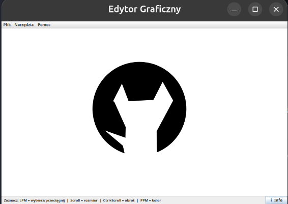

# Simple Vector Graphic Editor

A lightweight graphical user interface application built in **Java (Swing)** (developed as a part of a uni course) allowing real-time geometric shape construction, mouse-driven spatial matrix transformations, and raw filesystem save serialization states. 

##  Features

The application incorporates three structural execution target paths:

1. **Vector Object Construction:**
   * Interactive creation tools covering standard Circle components (`Circle`), Rectangle profiles (`Rectangle`), and center-of-gravity bounded custom Triangle path shapes (`Poli`).
   * Supports complex layouts housing multiple instances concurrently on an isolated rendering panel thread.
2. **Dynamic Affine Spatial Manipulations (Transforms):**
   * **Focus Selection:** Allows binding individual elements to an active edit status hook via standard cursor selection.
   * **Translation Layout:** Real-time mouse pointer drag (LMB) shifts elements smoothly on the coordinate space map.
   * **Uniform Scaling:** Resizes target bounding width and height via standard scroll wheels.
   * **Rotational Adjustments:** Multi-axis element spinning anchored at calculated object center point gravity vectors utilizing structural `Ctrl + Scroll Wheel` hooks.
3. **Serialization System & Attribute Customization:**
   * **Persistence Serialization:** Native binary stream parsing pipelines writing list instances directly out to disk through generic standard system dialog file pickers.
   * **Context Dropdown Trigger:** Right-click context hooks reading selection states instantly to invoke native popups hooked into the comprehensive color choice suite.

---

##  System Pre-requisites (Linux)

Execute the terminal layout command instructions down below to install development libraries and required dynamic documentation layout generation engines:

```bash
# OpenJDK (v11+)
sudo apt update && sudo apt install default-jdk

# Javadoc engine plugins, Doxygen configurations and Graphviz 
sudo apt install doxygen doxygen-gui graphviz

```
---

## 📸 Preview & Screenshots

Here is a visual preview of the Vector Graphic Editor in action:




---
